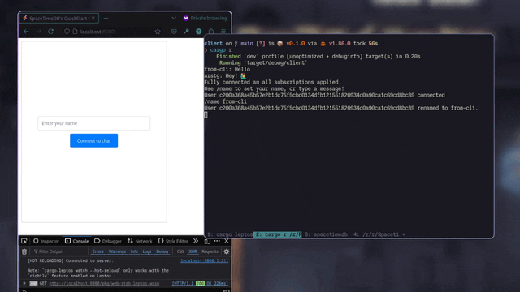

<div align="center">

This is a web client using Leptos for the SpacetimeDB's module [*quickstart-chat*](https://spacetimedb.com/docs/modules/rust/quickstart) 


</div>

### Running
After publishing your module through the SpacetimeDB's cli.

Install `cargo-leptos` if you haven't already.

```bash
cargo install cargo-leptos --locked
rustup target add wasm32-unknown-unknown
```

Then run
```bash
cargo leptos serve
```
